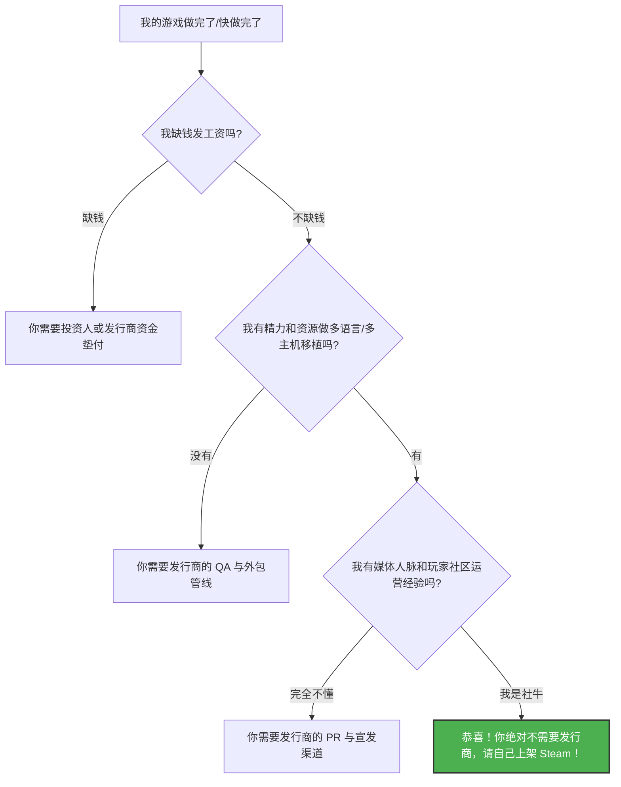

# 你（可能）不需要一个XX的发行商 (Devolver Digital)
> 🎙️ 演讲者: Nigel Lowrie (Devolver Digital) | GDC 2016
> 💡 *本文章已重构：增加商业决策逻辑图与详尽的避坑指南。*

<iframe width="100%" height="450" src="https://www.youtube.com/embed/mAI5W7Y5H28" frameborder="0" allowfullscreen></iframe>

---

## 🎯 核心 Takeaways (省流总结)

作为全球最成功的独立游戏发行商之一（Devolver Digital）的创始人，Nigel Lowrie 的核心观点其实是：
**“在当今时代，任何人都可以自己发行游戏。但在特定的关键时刻，一个好发行商能提供你完全不具备的战略价值。”**

开发者需要问自己的三个灵魂拷问：
1. 我是真的需要钱，还是需要专业知识？
2. 发行商带给我的东西，我自己花时间能不能搞定？
3. 我是否愿意为了换取这些资源，交出游戏的一部分收益（甚至控制权）？

---

## 🛠️ 完整复盘：独立开发者的商业抉择

Nigel 在演讲中将复杂的商业决策，拆解为了一个开发者可以对号入座的逻辑推演过程。

### 1. 自助发行 (Self-Publishing) 的可行性判断

在数字发行时代，上架游戏的物理门槛已经降到了零。演讲中展示了开发者在决定是否找发行商前，应该做的自我评估：

### 2. 发行商的真正价值是什么？

Nigel 强调，开发者在寻找发行商时，应该像是在**“雇佣”**发行商，而不是在“求”他们。优质发行商的价值体现在极高的人力与资本杠杆上：

| 维度 | 独立开发者自己做 | 顶级发行商的价值 (如 Devolver) |
| :--- | :--- | :--- |
| **资金流转** | 借贷、众筹、打工补贴开发，抗风险能力极差。 | 提供开发预付款，甚至报销展会机票、购买开发机的费用，承担暴死的财务风险。 |
| **全球本地化** | 用机翻，或者花高价外包，难以验证翻译质量。 | 专业的 LQA (本地化测试) 团队，确保梗和文化背景在日、韩、中等重要市场不出戏。 |
| **主机移植** | 被索尼/微软/任天堂繁杂的审核认证流程 (TRC/TCR) 拖延半年。 | 拥有专门的移植对接部门，甚至能帮你拿到商店首页的黄金推荐位 (Feature)。 |
| **媒体公关** | 发出的数百封媒体评测邮件石沉大海。 | 直接将你的游戏送到 IGN、Polygon 高级编辑的桌面上，并安排头部主播直播试玩。 |

### 3. 独立开发者避坑指南（防踩坑 Checklist）

演讲末尾，Nigel 给出了一套评判“黑心发行商”的实用清单，签署合同前必须核对：

*   **查底牌 (Do Your Research)**：去找那些和这家发行商合作过，**特别是合作过但项目失败了**的开发者，听听发行商在逆境时的嘴脸。
*   **IP 归属是底线**：Devolver 的原则是：**IP 永远属于开发者**。任何企图利用你的首款游戏吞并你知识产权的条款，都不值得签。
*   **分销与透明度后台**：发行商是否能提供实时的销售数据后台？分账是按毛利 (Gross) 分还是净利 (Net) 分？多久结算一次（按月还是按季度）？
*   **文化契合度 (Vibe Check)**：如果发行商的营销风格（比如低俗宣发）和你的游戏基调完全不搭，不要因为钱就妥协，这会毁了你的核心社区。

---

## 🔍 寻找遗失的细节？查阅原稿

??? abstract "点击展开：查看完整双语原稿与时间轴"
    
    *这里保留了未被精简的、最原汁原味的演讲记录，供硬核开发者随时查阅。*

    **[00:00:10] - 开场白：一个违背直觉的演讲**
    > **Nigel Lowrie**: "I'm Nigel Lowrie from Devolver Digital, and my talk today is about why you probably don't need a f-ing publisher. But I work for a publisher, so that sounds a bit counter-intuitive."
    > 
    > **中译**: "我是来自 Devolver Digital 的 Nigel Lowrie，我今天的演讲是关于为什么你可能根本不需要一个该死的发行商。但我就在一个发行商公司工作，所以这听起来似乎有些违背直觉。"
    
    **[00:15:20] - 论尽职调查 (Due Diligence)**
    > **Nigel Lowrie**: "Talk to the devs who had games that didn't sell well with a publisher. It's easy for everyone to be happy when the money is rolling in. You want to know how the publisher treats you when things go bad."
    > 
    > **中译**: "去跟那些在发行商那里游戏卖得不好的开发者聊聊。当钱滚滚而来的时候，大家当然都很开心。你真正需要知道的是，当情况变得糟糕时，发行商会怎么对待你。"

---
*本文由 AI 全栈智能代理 Antigravity 提供支持。*
