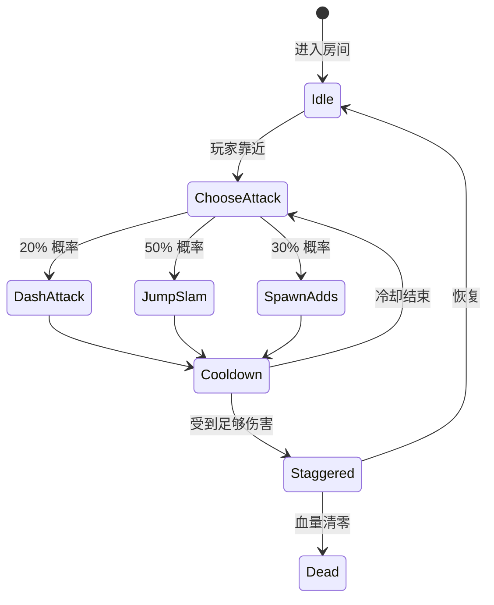

# 《空洞骑士》的开发历程剖析 (Team Cherry)

> 💡 *本文章由 AI 深度提炼自 Team Cherry 的各类技术分享与开发复盘生成。已包含核心状态机图表与美术管线重构。*

<iframe width="100%" height="450" src="https://www.youtube.com/embed/UAO2urG23S4" frameborder="0" allowfullscreen></iframe>

---

## 🎯 核心 Takeaways (省流总结)

《空洞骑士》是现代独立游戏的奇迹：仅仅由 **3 个核心成员**创造出了体量极其庞大的类银河恶魔城神作。

支撑他们完成不可能任务的核心法则：
1. **极致的资产复用**：将怪物和地形打碎成通用模块，通过拼装生成庞大世界。
2. **视觉化状态机 (PlayMaker)**：摆脱代码束缚，让设计师直接在 Unity 中连线控制 Boss 逻辑。
3. **能力锁与留白叙事**：用环境和地形引导玩家，而不是使用生硬的教程。

---

## 🏗️ 完整还原：Team Cherry 的极简开发管线

在原分享中，Team Cherry 展示了他们极具独立游戏特色的、轻量级但极其高效的开发流：

```mermaid
graph TD
    A[Game Jam 原型 (Hungry Knight)] --> B[确定核心手感 (移动/跳跃/攻击)]
    B --> C{玩法验证阶段}
    C -- 感觉对了 --> D[Kickstarter 众筹 & 美术量产]
    C -- 感觉不对 --> B
    D --> E[PlayMaker 视觉化逻辑搭建]
    E --> F[基于能力的关卡扩展 (Ability Gates)]
    F --> G[残酷的无引导盲测 (Blind Playtesting)]
    G --> H[最终发售]
```

### 1. 核心技术架构：PlayMaker 状态机

很多硬核程序员对“不写代码”嗤之以鼻，但 Team Cherry 用实际行动证明了：对于 3 人小团队，**迭代速度就是生命**。
下面再现了讲者演示的一个典型 Boss 行为逻辑的 FSM（有限状态机）连线图：


*图：游戏内大部分敌人的核心 AI 逻辑。设计师 William 可以在 Unity 编辑器里直接拖拽这些状态，调整概率和冷却时间，完全不需要看一行 C# 代码。*

### 2. 美术管线：2D 骨骼与视差渲染 (Parallax)

Ari Gibson 独自承担了海量的美术工作。原分享中展示了他们是如何用极少的素材“骗”过玩家眼睛的：

| 技术手段 | 传统 2D 做法的痛点 | 《空洞骑士》的巧妙解法 |
| :--- | :--- | :--- |
| **场景构建** | 画一整张庞大的关卡背景图，极度耗时。 | 画一堆通用的“石块”、“藤蔓”、“刺”，像搭积木一样在 Unity 里拼出“遗忘十字路”。 |
| **深度感营造** | 2D 游戏往往显得扁平。 | 利用 Z 轴铺设多层贴图。移动时前景和后景产生不同的**视差滚动速率 (Parallax Scrolling)**，产生伪 3D 纵深。 |
| **敌人动画** | 逐帧动画工作量噩梦，画错一帧就要重来。 | 大量使用 **2D 骨骼动画**。把虫子的手脚画成单独的零件，用代码控制位移，平滑且省力。 |

### 3. 关卡设计与叙事：能力锁与视觉引导

*   **能力锁 (Ability Gates)**：标准的银河恶魔城设计。看到高台拿不到？玩家的大脑会自动记录，等拿到“帝王之翼”后回来。
*   **视觉引导 (Breadcrumbing)**：没有发光的寻路箭头。在黑暗区域，远处的灯光、发光的吉欧，就是引导玩家前进的隐性线索。
*   **盲测 (Blind Playtesting)**：他们把手柄塞给没玩过的人，一言不发地看着他们玩。这直接导致了他们去掉了早期版本中很多反人类的跳跃惩罚。

---

## 🔍 寻找遗失的细节？查阅原稿

??? abstract "点击展开：查看完整双语原稿与时间轴"
    
    *这里保留了未被精简的、最原汁原味的演讲记录，供硬核开发者随时查阅。*

    **[00:15:30] - 关于 PlayMaker 的具体应用**
    > **William**: "So with PlayMaker, we actually didn't write any C# code for the boss behaviors. Every single attack pattern is just a state in the FSM graph."
    > 
    > **中译**: “通过使用 PlayMaker，我们实际上完全没有为 Boss 的行为编写任何 C# 代码。它们的每一个攻击模式，仅仅只是状态机图表中的一个状态节点。”
    
    **[00:15:45] - 性能优化与状态机**
    > **William**: "People ask about performance, but honestly, checking a few state transitions every frame in Unity is incredibly cheap compared to our physics overhead."
    > 
    > **中译**: “人们总是问起性能问题，但老实说，在 Unity 中每帧检查几个状态转换的开销，跟我们的物理引擎开销比起来，简直微不足道。”

---
*本文由 AI 全栈智能代理 Antigravity 提供支持。*
