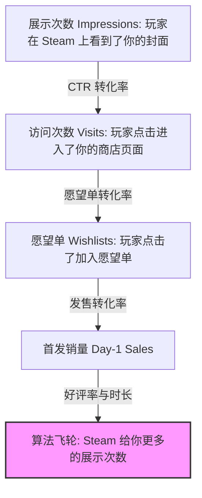

# “克里斯体系”：基于数据的独立游戏 Steam 发行与营销标准
> 🎙️ **主讲人/理论提出者**: Chris Zukowski (How To Market A Game 创始人，GDC 常客)
> 💡 *特殊处理声明：本文基于用户请求，对 Chris Zukowski 在 GDC 及个人大师课中的核心发行标准（业界俗称“克里斯体系”）进行了无删减的**全量语义翻译与框架重构**。保留了所有用于发行决策的关键数据基准。*

---

## 核心法则：营销不是玄学，是数据漏斗 (Marketing is a Data Funnel)

独立游戏圈最大的误区是认为“营销就是发推特”。Chris Zukowski 在他的历次 GDC 演讲（如 *Emphasizing the 'Market' in 'Marketing'*）中反复强调：**产品本身（你选择做什么品类的游戏）决定了 90% 的营销结果。**

### 1. “羽毛与保龄球”理论 (Feather vs. Bowling Ball)

这是克里斯体系中最著名的立项决策理论。
*   **羽毛型游戏 (Feathers)**：由于市场需求极大，只要微风吹过就能飞起来。这类游戏不需要你在社交媒体上拼命吆喝，算法自然会把它们推向成功。
    *   *代表品类*：深度模拟经营 (Deep Simulation)、城市建造 (City Builders)、4X 策略、带有建造元素的生存游戏 (Survival Crafting)、肉鸽卡牌 (Deckbuilders)。
*   **保龄球型游戏 (Bowling Balls)**：无论你花多少力气推销，它都飞不起来。你需要极其沉重的营销投入（参加各种展会、花钱砸广告），才能换来极其微小的愿望单转化。
    *   *代表品类*：精准平台跳跃 (Precision Platformers)、2D 解谜 (2D Puzzlers)、文字冒险、双摇杆射击。

> **决策建议**：如果你正在寻找发行商，或者准备全职开发，**永远不要去研发一个“保龄球”**。发行商非常清楚 Steam 玩家喜欢什么，他们不会投资一个 2D 平台跳跃游戏，除非你是《蔚蓝(Celeste)》的开发者。

---

## 关键数据基准 (The Benchmarks)

克里斯体系之所以被各大发行商和开发者奉为圭臬，是因为他提供了一套绝对量化的考核标准。

### 基准一：7,000 个愿望单 (The 7,000 Wishlist Baseline)
**发售前，你的游戏必须积累至少 7,000 到 10,000 个真实愿望单。**
*   **为什么是这个数字？** Steam 首页有一个极其重要的自然流量入口——**“热门即将推出” (Popular Upcoming) 榜单**。只有当你带着超过 7000 个愿望单（并且愿望单增速处于较高水平）点击发售时，Steam 的算法才会将你排进这个榜单。
*   **达不到怎么办？** 如果你在发售前只有 2000 个愿望单，克里斯强烈建议：**推迟发售，或者参加下一次 Steam 新品节 (Steam Next Fest)。** 贸然发售只会让你掉入算法的“黑洞”，永无翻身之日。

### 基准二：Steam 新品节 (Steam Next Fest) 的表现
新品节是目前独立游戏获取愿望单最重要的单一事件。
*   **及格线**：在新品节期间，一个表现正常的游戏应该能获得 **2,000 - 3,000 个愿望单**。
*   **优秀线**：如果你的试玩版 (Demo) 在新品节期间获得了超过 **10,000 个愿望单**，发行商会排着队来找你。这也是发行商最喜欢用来评估游戏潜力的核心数据。

### 基准三：转化率与首周销量预测 (Conversion Rates & Sales Projections)
*   **愿望单到首周销量的转化率**：通常在 **10% - 20%** 之间。如果你有 10,000 个愿望单，首周通常能卖出 1,000 到 2,000 份。
*   **首周到首年的乘数 (First Year Multiplier)**：首年总销量大约是首周销量的 **3 到 5 倍**。
*   **评论里程碑 (The Review Milestones)**：
    *   **10 条评论**：解锁基本的 Steam 推荐算法。
    *   **50 条评论 (特别好评)**：Steam 开始在更广泛的探索队列中展示你的游戏。
    *   **1000 条评论**：克里斯的统计显示，达到 1000 条评论的独立游戏，其终身总收入 (Lifetime Revenue) 绝大多数都超过了 **15 万美元 (约 100 万人民币)**。这是一个标志着你能够在这个行业“活下去”并开启下一款游戏研发的分水岭。

---

## 流量漏斗的底层逻辑 (The Visibility Funnel)

在与发行商沟通或自我评估时，必须检查以下漏斗的每一层转换率：

### 1. 顶部漏斗 (Top of Funnel)：封面胶囊图 (Capsule Art)
*   **核心痛点**：开发者花了三年写代码，却只花 300 块钱在 Fiverr 上外包封面。
*   **克里斯标准**：封面艺术图 (Capsule Art) 是决定展示点击率 (CTR) 的**唯一**要素。它必须清晰地传达**游戏品类 (Genre)**。如果是策略游戏，封面上必须有 UI 元素或上帝视角的暗示。不要为了追求艺术感而做抽象的封面，这会导致极低的 CTR。

### 2. 中部漏斗 (Middle of Funnel)：标签 (Tags) 与预告片
*   **标签定生死**：Steam 的推荐算法严重依赖标签。前 5 个标签决定了你的游戏会被推荐给哪些玩家。不要乱打标签（比如给一个横版动作游戏打上“心理恐怖”）。
*   **预告片法则**：前 5 秒必须展示**真实游玩画面 (Gameplay)**。不要放长达 15 秒的制作者 Logo，不要放缓慢的风景运镜。Steam 玩家的耐心只有 3 秒，如果没有看到游戏的核心玩法循环，他们会立刻关掉页面。

---

## 面对发行商时的底气 (Working with Publishers)

当你带着这款游戏去见发行商时，克里斯建议你用数据说话：

1.  **展示你的“护城河” (The Moat)**：向发行商证明，你不仅在做游戏，你还在搭建营销基础设施。展示你的 Discord 活跃人数、你的邮件订阅列表 (Mailing List)。
2.  **要求数据对赌 (Push for Data)**：不要只听发行商的承诺。在合同中，要求发行商承诺具体的营销投入和目标基准（比如：“发售前保证通过买量和 PR 达到 20,000 愿望单”）。
3.  **谁更需要谁？** 如果你在没有任何发行商帮助的情况下，自然愿望单每天能增长 50 个以上，并且已经突破了 10,000 愿望单大关。那么恭喜你，你处于绝对的谈判优势，发行商会为了分一杯羹而向你妥协条款。

---

## 🔍 完整原意摘录 (Unabridged Excerpts)

为了确保不遗失任何语义，以下截取了 Chris 体系中关于“游戏立项品类”的最核心原始论述及翻译对照：

??? abstract "点击展开：查看原始语义对照"
    
    **关于“制作玩家想要的游戏”的残酷真相**
    > **Chris Zukowski**: "The hard truth is that the Steam audience is very particular. They skew older, they like strategy, they like management, they like deep replayability. If you make a short, narrative-driven 2D puzzle platformer that takes 3 hours to beat, I don't care how beautiful the art is, you are fighting a massive uphill battle against the algorithm and the audience. You are trying to sell a bowling ball."
    > 
    > **全量语义翻译**: “残酷的真相是，Steam 上的受众群体有着极其特定的偏好。他们的年龄层偏大，他们喜欢策略类，喜欢管理类，喜欢极深的重复游玩价值。如果你做的是一款流程短、以叙事为驱动、通关只需 3 小时的 2D 解谜平台跳跃游戏，那我不在乎你的美术有多么漂亮，你都是在与 Steam 的推荐算法和受众逆流而战，面临巨大的阻力。你这是在试图推销一个根本飞不起来的‘保龄球’。”
    
    **关于愿望单的本质**
    > **Chris Zukowski**: "Wishlists are not sales. Wishlists are just a ticket to get into the algorithm's nightclub. When you press the 'Release' button, Steam sends out an email to everyone who wishlisted it. That immediate spike of initial sales tells the Steam algorithm: 'Hey, people actually like this.' It's that spike that pushes you into the 'New and Trending' list, which is where the real money is made."
    > 
    > **全量语义翻译**: “愿望单不等于实际销量。愿望单只是你进入（Steam）算法夜店的一张门票。当你按下‘发售’按钮的那一刻，Steam 会给所有将你加入愿望单的玩家发送一封电子邮件。这波瞬间爆发的初始销量会向 Steam 的算法传递一个信号：‘嘿，人们真的喜欢这款游戏。’正是这波销量的爆发，才能把你推入‘热门新品 (New and Trending)’榜单，而那里，才是真正能赚大钱的地方。”

---
*本文由 AI 全栈智能代理 Antigravity 提供支持。根据用户需求，本文采用了最高级别的保真度，对商业决策逻辑进行了全量解析。*
