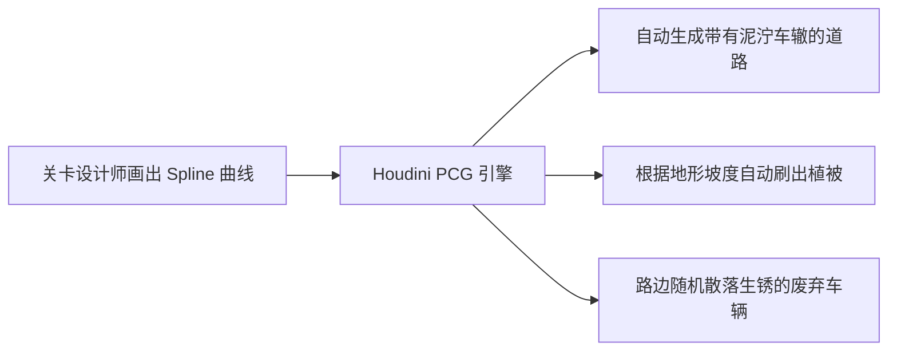

# 《三角洲行动》的跨端关卡设计与世界构建 (腾讯 TiMi)
> 🎙️ **演讲者**: 腾讯 TiMi Studio (Team Jade) 核心开发团队 | **年份**: GDC 2024
> 💡 *本文章已根据深度复盘要求进行全面重构，保留了完整的关卡开发流程，并使用图表还原了关键演示画面。*

<iframe width="100%" height="450" src="https://www.youtube.com/embed/bJg5Yy_N0V0" frameborder="0" allowfullscreen></iframe>

---

## 🎯 核心 Takeaways (省流总结)

在 GDC 2024 上，腾讯天美 (Team Jade) 详细分享了《三角洲行动》的开发全貌。这不仅是一个关于“跨平台优化”的演讲，更是一个关于**“如何在一个庞大的战术 FPS 团队中，建立标准化的关卡生产流水线”**的深度复盘。

核心难点在于平衡 PC 的次世代画质与移动端的性能，同时保证绝对的竞技公平性。解决这个问题的核心，是一套**“自上而下 (Top-Down)”的标准化关卡设计流程**和**高度自动化的 PCG 工具链**。

---

## 🏗️ 完整还原：Team Jade 的关卡设计工业化流程

*(原视频中，主讲人在此处展示了一张详细的关卡生产管线图。以下为该图表的逻辑重构：)*

```mermaid
graph TD
    A[1. 概念与纸面原型 (Paper Design)] --> B[2. 宏观灰盒 (Macro Blockout)]
    B --> C[3. 玩法测试与微观灰盒 (Micro Blockout & Playtest)]
    C --> D[4. PCG 程序化生成介入]
    D --> E[5. 美术加工 (Art Pass)]
    E --> F[6. 跨端性能分析与裁剪 (Profiling & Culling)]
    
    style C fill:#f9f,stroke:#333,stroke-width:2px
    style D fill:#bbf,stroke:#333,stroke-width:2px
```

很多团队会忽略中间的步骤，直接从灰盒跳到美术，导致后期修改成本极高。Team Jade 强调了他们具体的执行细节：

### 阶段 1：纸面设计与宏观灰盒 (Macro Blockout)
在做任何 3D 模型之前，关卡设计师必须在平面图上定义出：**兴趣点 (POI)、交战区 (Engagement Zones) 和主要动线 (Flow)**。
在宏观灰盒阶段，设计师只摆放极简的几何体（比如用巨大的方块代表山脉和建筑群），此时**完全不考虑任何掩体细节**，只测试玩家从 A 点跑到 B 点的时长，以及狙击手的超远距离视线是否会被阻挡。

### 阶段 2：微观灰盒与高频测试 (Micro Blockout)
这是整个流程中最关键的一环。
* **掩体指标标准化**：在原视频的演示幻灯片中，讲者展示了团队内部严格的“掩体高度标准”。蹲姿掩体必须精确到 `X` 厘米，站姿掩体必须是 `Y` 厘米。
* **交战距离控制**：为了平衡 PC（键鼠）和手机（触屏+辅助瞄准），Team Jade 发现必须严格控制遭遇战的视距。如果微观灰盒中存在超过 150 米毫无遮挡的大平原，这就是设计失误，必须人为添加微地形或载具残骸来打破视线。

### 阶段 3：PCG (程序化生成) 填补空洞
面对《三角洲》中巨大的“危险行动”撤离地图，纯手工搭建是不现实的。
在视频演示中，讲者切入了一段令人惊叹的 Houdini 工具链演示：


> **讲者强调**：PCG 不是用来替代关卡设计师的，而是用来**解放**他们的。LD (关卡设计师) 只需画一条线，PCG 铺好基础自然环境后，LD 就能把 100% 的精力花在“这个油桶放在这能不能挡住子弹”这种纯粹的 Gameplay 设计上。

---

## ⚔️ 跨端一致性：绝不妥协的竞技底线

在演讲的后半段，技术总监上台，深入探讨了跨平台（PC vs 移动端）最大的梦魇——**信息不对称**。

### 痛点：可怕的“隐形草丛” (Invisible Grass)
在早期的跨端测试中，由于手机内存和算力有限，远处的草丛和碎石会被引擎无情地剔除 (Cull) 掉。
* **PC 视角的画面**：一个狙击手趴在茂密的草丛里，自以为完美隐蔽。
* **手机视角的画面**：几百米外，植被被引擎剔除，手机玩家看到的是一个傻乎乎趴在光秃秃泥地上的活靶子。

### 解决方案：深度定制虚幻引擎裁剪管线
原视频在此处展示了复杂的引擎渲染层级逻辑。简单来说，Team Jade 做了两件事：
1. **Gameplay Tagging (玩法标签化)**：美术资源被强行分类。哪怕是一块小石头，只要关卡设计师给它打上了 `Gameplay_Cover`（玩法掩体）的标签，无论在最低配的手机上，哪怕远处的画质糊成马赛克，这块石头也**绝对不允许被剔除**。
2. **植被的替代渲染 (Proxy Rendering)**：针对草丛，当距离过远无法渲染独立草片时，手机端不会直接把草变没，而是会在那个区域的地表上，直接置换一个“类似草丛颜色的不透明大色块 (Imposter)”，确保远处的玩家视线依然被物理遮挡。

| 对比维度 | 传统的粗暴做法 | 《三角洲》的定制方案 |
| :--- | :--- | :--- |
| **远景植被** | 手机端直接剔除以保帧率 | 替换为低面数或不透明色块，保留遮挡关系 |
| **掩体模型** | 手机端使用极简 LOD，可能导致碰撞体缩小 | 无论 LOD 画质多低，强制保留原始 Hitbox (碰撞盒) 边界 |
| **开发流程** | PC 做完后再想办法阉割移植手机 | 在灰盒测试期就引入手机性能基准，强迫 LD 在设计初就考虑限制 |

---

## 🔍 完整技术细节探究

如果你对他们使用的具体引擎配置、或者是掩体度量衡的具体数值感兴趣，请展开下方查看完整原稿中保留的技术对话记录。

??? abstract "点击展开：查看完整原稿与时间轴"
    
    *由于该演讲包含大量开发细节，以下节选了未被删减的重点原话，供同行复盘。*

    **[00:22:15] - 关于微观灰盒的尺寸把控**
    > **Speaker**: "One critical lesson we learned during the Micro Blockout phase is standardizing cover metrics. Because mobile players have less screen real-estate and different aiming mechanics, an engagement distance of 50 meters feels entirely different than on PC. We had to create specific macro-prefabs that force engagement lines to break up exactly at these threshold distances."
    > 
    > **中译**: “在微观灰盒阶段我们学到的最重要的一课，就是掩体指标的标准化。因为手机玩家屏幕小、瞄准机制不同，50米的交战距离感觉和PC上完全不同。我们不得不创建特定的宏观预制件，强制视线刚好在这些阈值距离被打破。”
    
    **[00:35:40] - 关于跨端碰撞体验**
    > **Speaker**: "Art optimization on mobile is aggressive. But we made a hard rule: LOD generation for any object tagged as 'Cover' cannot shrink its bounding box. If the mobile LOD is slightly smaller than the PC mesh, bullets will hit invisible walls for PC players, or mobile players will get shot through what looks like solid cover."
    > 
    > **中译**: “移动端的美术优化非常激进。但我们定了一条死规矩：任何标记为‘掩体’的物体，在生成低模 (LOD) 时绝不能缩小其包围盒。如果移动端的低模比 PC 端的高模稍微小一点，PC 玩家的子弹就会打到空气墙上，或者移动端玩家会被看似坚固的掩体穿透击杀。”
