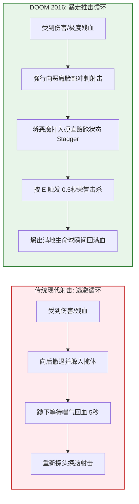
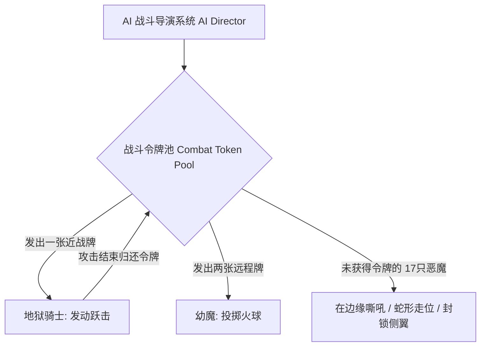

# 《DOOM (2016)》推击战斗论：如何用“荣誉击杀”与 AI 令牌终结掩体射击
> ✍️ **核心开发团队**: id Software (Hugo Martin & Marty Stratton)
> 💡 *本文章由 AI 深度提炼生成。全面拆解现代 FPS 最具革命性的战斗设计——如何让玩家在残血时不是后退找掩体，而是更加疯狂地迎头冲锋。*

---

## 🎯 核心 Takeaways (省流总结)

在《使命召唤》和《战争机器》统治的年代，“躲在矮墙后面等血条自动回复”成为了射击游戏的主流。然而 id Software 在《DOOM (2016)》中彻底掀翻了这一套，开创了**“推击战斗” (Push-Forward Combat)**。

其三大核心设计支柱：
1. **进攻即治疗 (Offense is Health / Glory Kills)**：掉血了？不要躲！近战手撕发光恶魔（荣誉击杀）是获取生命值和弹药的**唯一核心途径**。
2. **AI 攻击令牌管理 (AI Combat Tokens)**：场上可以有 30 只恶魔，但系统只发 2 张“近战攻击牌”和 3 张“远程射击牌”，既保证压迫感，又避免混乱围攻。
3. **“棋盘”式武器与恶魔克制矩阵 (Combat Chess)**：电浆枪破盾、超级霰弹贴脸、火箭筒清杂，把射击变成毫秒级的暴力解谜。

---

## 🏗️ 完整还原：推击战斗闭环 vs 传统掩体射击

### 1. AI 令牌系统 (The AI Token System)

如果 20 只恶魔同时跳起来拍你，玩家瞬间就会被秒杀。id Software 的解决方案是**“幕后发牌机制”**：

*   **设计精妙点**：玩家以为自己一个人在单挑 20 只暴走的嗜血恶魔，实际上背后的导演正在严格按照节拍，轮流派怪上来“送死”。

### 2. 资源掉落的“精准投喂”算法

| 击杀方式 | 掉落资源倾向 | 核心设计意图 |
| :--- | :--- | :--- |
| **普通枪械射杀** | 几乎不掉落任何补给 | 惩罚远程猥琐流打法 |
| **荣誉击杀 (Glory Kill)** | 狂喷大量绿色生命球 | 奖励近距离冒险肉搏 |
| **电锯处决 (Chainsaw)** | 像皮纳塔彩罐一样爆出全弹药 | 解决高强度战斗中的弹药枯竭，强制切换武器 |

---

## 💡 动作/射击游戏设计启示

1. **把生存资源绑在危险行为上**：如果你想让玩家怎么玩，就把血包和金币放在哪里。想让玩家近战？那就把回血机制放在近战处决里。
2. **移动速度就是生命值**：DOOM 中的毁灭战士没有“换弹夹”键，也没有“跑动体力条”，全速移动时的规避率远高于原地站桩。

---

## 🔍 经典原话摘录

??? abstract "点击展开：查看 Hugo Martin 关于推击战斗的论述"

    **关于推击哲学的本质**
    > **Hugo Martin**: "In DOOM, fear is the mind-killer. If you back up, you die. The entire geometry of our arenas, the resource drops, the music, everything screams at the player: 'CHARGE FORWARD. YOUR HEALTH PACK IS INSIDE THAT DEMON'S CHEST.'"
    > 
    > **中译**: “在《DOOM》里，恐惧是唯一的死因。只要你后退，你就必死无疑。我们竞技场的几何构造、资源掉落、重金属背景音乐，一切都在向玩家咆哮：‘向前冲锋！你的血包就藏在那只恶魔的胸膛里！’”

---
*本文由 AI 全栈智能代理 Antigravity 整理归档。*
