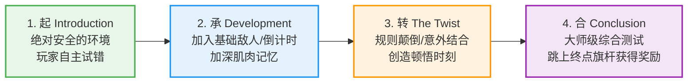
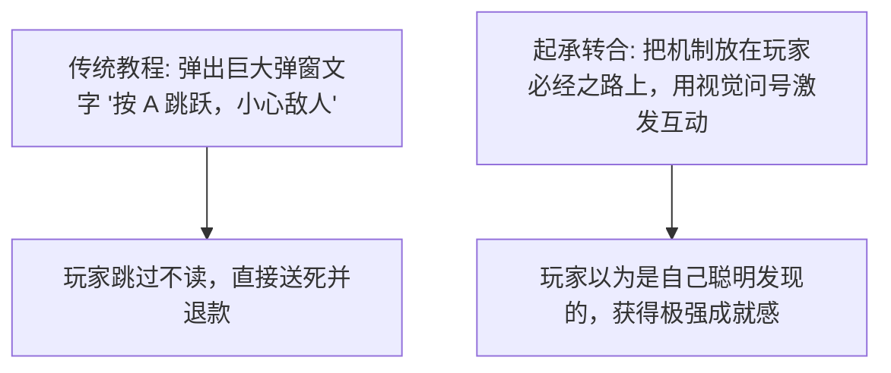

# 《任天堂“起承转合”关卡设计法》：马力欧如何用四幕剧让所有人无师自通
> ✍️ **核心源流**: 宫本茂 & 小泉欢晃 (任天堂关卡设计哲学，以《超级马力欧：3D世界》为代表)
> 💡 *本文章由 AI 深度提炼生成。全面揭秘任天堂如何在不写一句文字新手教程的前提下，教会全球几亿人玩游戏的终极关卡范式。*

---

## 🎯 核心 Takeaways (省流总结)

任天堂的游戏（特别是《超级马力欧》系列）被公认为全年龄段都能上手的关卡设计天花板。其底层核心并不是什么复杂的算法，而是源自东亚古典四段式诗歌结构的**“起·承·转·合” (Kishōtenketsu, 起承転結)**。

每一个马力欧关卡，都是围绕一个单一机制（如：踩一下会翻转的踏板、踩一下会喷射的管道）展开的四步心流闭环：
1. **起 (Introduction)**：在绝对安全的环境下引入新机制，让玩家通过好奇心自主掌握。
2. **承 (Development)**：在低风险的进阶挑战中加深对机制的熟练度。
3. **转 (Twist)**：将该机制与另一个毫不相关的机制强制结合，带来意想不到的危机与惊艳。
4. **合 (Conclusion)**：提供终极挑战与释怀奖励，完成能力验证后收尾。

---

## 🏗️ 完整还原：四段式关卡结构剖面图

### 1. 以“踩踏翻转踏板 (Flip Panels)”关卡为例的实战拆解

| 阶段 | 关卡实际场景构筑 | 玩家的大脑心理活动 | 死亡风险 |
| :--- | :--- | :--- | :--- |
| **起 (Introduction)** | 踩下踏板，踏板从蓝色变成红色并向右翻转。下方是坚固的平地。 | “咦，我按跳跃的时候，这个地板翻过来了？有意思。” | **0% (死不掉)** |
| **承 (Development)** | 几个连续的翻转踏板横跨一段浅沟，沟底有几个可以踩死的栗子怪。 | “我需要算好节奏跳过去，踩在正确的颜色上。” | **低 (可能扣血)** |
| **转 (The Twist)** | **突然出现会发射电球的机关！** 玩家不仅要跳跃翻转踏板，还要利用踏板翻转瞬间躲避横向飞来的致命电光。 | “卧槽！原来这个踏板立起来的时候还能当盾牌挡子弹！” | **高 (掉入深渊)** |
| **合 (Conclusion)** | 连续三个高难度的连续翻板极限跳跃，紧接着是高耸的终点旗杆。 | “我彻底征服了这个机制！我是关卡大师！” | **极高 (直通胜利)** |

### 2. 为什么“起承转合”能消灭一切生硬的新手教程？

---

## 💡 关卡设计师实用 Checklist

1. **一关只讲一个“核心动词”**：不要在一关里既塞入水下重力、又塞入冰面滑动、还塞入激光解谜。把一个机制挖深，比堆砌十个浅薄的机制好得多。
2. **“起”的绝对安全性**：在教玩家第一次认识新敌人或新机关时，**地板绝对不能有深渊**。给玩家至少一次“犯错而毫无惩罚”的实验空间。
3. **“转”必须有情理之中的意外**：“转”不是换一个全新的东西，而是**把已学过的机制换一个全新的上下文**（例如：原本用来踩怪的龟壳，在“转”的阶段被用来当钥匙扔向远处开关）。

---

## 🔍 经典语录摘录

??? abstract "点击展开：查看小泉欢晃关于关卡节奏的论述"

    **关于任天堂的无字教学哲学**
    > **Yoshiaki Koizumi**: "If a player needs to read a manual to understand how your level works, you have failed as a level designer. The architecture of the space itself should be the manual."
    > 
    > **中译**: “如果玩家需要阅读文字说明书才能明白你的关卡是怎么运作的，那么作为一名关卡设计师，你已经失败了。空间本身的几何架构，就应该是一本无形的说明书。”

---
*本文由 AI 全栈智能代理 Antigravity 整理归档。*
