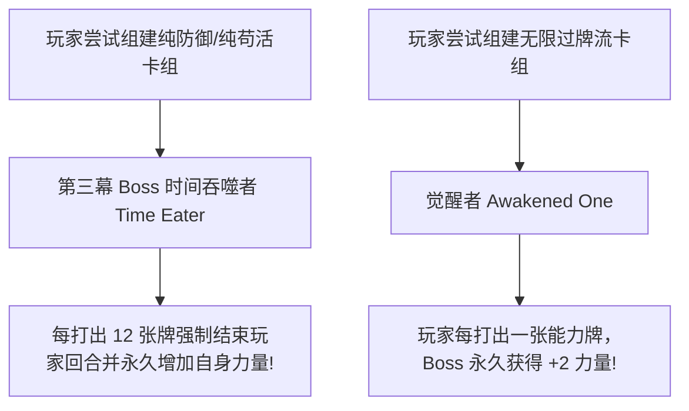

# 《杀戮尖塔》卡牌数值与协同架构：如何用“能量曲线”与乘法效应设计肉鸽构筑
> ✍️ **核心主创**: Anthony Giovannetti & Casey Yano (Mega Crit Games 创始人)
> 💡 *本文章由 AI 深度提炼生成。全面拆解 Roguelike 卡牌构筑 (Deckbuilder) 这一品类开山之作背后的数值平衡与协同网络。*

---

## 🎯 核心 Takeaways (省流总结)

《杀戮尖塔》(Slay the Spire) 几乎单枪匹马定义了“肉鸽卡牌构筑 (Roguelike Deckbuilder)”这一全球品类。无数后来的模仿者都陷入了“要么太难通不了关，要么太容易导致套路单一”的数值泥潭。

Mega Crit 团队能够做到几千场对局依旧平衡的核心秘诀：
1. **加法叠加 vs 乘法协同 (Additive vs. Multiplicative Synergy)**：弱卡牌之间形成指数级倍增效应（如：力量 + 多段攻击 + 易伤）。
2. **严格的“能量与手牌”经济学 (Energy & Card Draw Economy)**：基础 3 费与每回合 5 张牌是不可动摇的物理常量。
3. **“动态问题”与反套路敌人设计**：第一幕考爆发输出（地精大块头），第二幕考群体 AOE 与防穿透，第三幕考极速叠甲与去卡组膨胀，防止“一招鲜吃遍天”。

---

## 🏗️ 完整还原：卡牌构筑的乘法协同模型

在原作者的分享中，他们强调了一个根本数学法则：**优质构筑不是把单张强卡塞进卡组，而是创造“乘数放大器”**。

```mermaid
graph LR
    Base[基础单卡: 打击 6点伤害] --> S1[加法层: 力量 +3]
    S1 --> S2[乘法层 A: 连续多段判定 4次攻击]
    S2 --> S3[乘法层 B: 目标附加 '易伤 Vulnerable' 状态 1.5倍]
    S3 --> Final[终极结算: (6 + 3) * 4 * 1.5 = 54点毁灭伤害!]
    
    style Base fill:#e0e0e0,stroke:#333
    style S3 fill:#fff9c4,stroke:#fbc02d,stroke-width:2px
    style Final fill:#ffcdd2,stroke:#d32f2f,stroke-width:2px
```

### 1. 为什么“删牌”是游戏里最强力的操作？

很多新手喜欢见到新卡就抓，导致卡组变成 40 张的臃肿大杂烩。

| 卡组形态 | 抽到核心启动组件的概率 | 面对 Boss 蓄力大招时的生存率 |
| :--- | :--- | :--- |
| **臃肿卡组 (35+ 张牌)** | 抽到核心牌（如恶魔形态/幽灵形态）的概率低于 20% | 极高概率在关键回合抽到 5 张无用普通打击，瞬间暴毙 |
| **精简卡组 (15-20 张牌)**| 每 2-3 回合必定循环一次核心组件 | 防御牌与过牌高效运转，形成无缝护甲链 |

*结论：在商人处“花钱删一张普通打击”，在数学期望上远胜于“花钱买一张普通攻击牌”。*

### 2. 敌人行为树的反制设计


*   **设计精髓**：没有绝对无敌的“终极套路”。游戏通过 Boss 机制强迫玩家在爬塔过程中不断微调卡组，做出妥协与进化。

---

## 💡 肉鸽卡牌开发避坑指南

1. **遗物 (Relics) 必须改变思考方式**：遗物不应该只是简单地“+5% 攻击力”。优秀的遗物必须是**行为修正器**（例如：“日晷”——每洗牌 3 次获得 2 点能量，这会促使玩家去计算洗牌频率）。
2. **给玩家“我很聪明”的发现感**：不要在新手教程里明写某种流派（如“毒爆流”或“交锋流”）。把具有潜在互动的机制打碎散落在卡池中，让玩家在偶然联动时产生“我发明了全新战术”的狂喜。

---

## 🔍 经典原话摘录

??? abstract "点击展开：查看 Anthony 关于平衡性的论述"

    **关于如何让弱卡变神卡**
    > **Anthony Giovannetti**: "A card that is bad on Floor 1 might be the single card that saves your life on Floor 45. That is the essence of deckbuilding. If a card is always good in every situation, it is badly designed."
    > 
    > **中译**: “一张在第 1 层看起来极其垃圾的卡，可能恰恰是在第 45 层拯救你性命的唯一救命稻草。这就是卡组构筑的精髓所在。如果一张卡在任何情况下都是闭着眼睛选的最优解，那它就是一个失败的设计。”

---
*本文由 AI 全栈智能代理 Antigravity 整理归档。*
