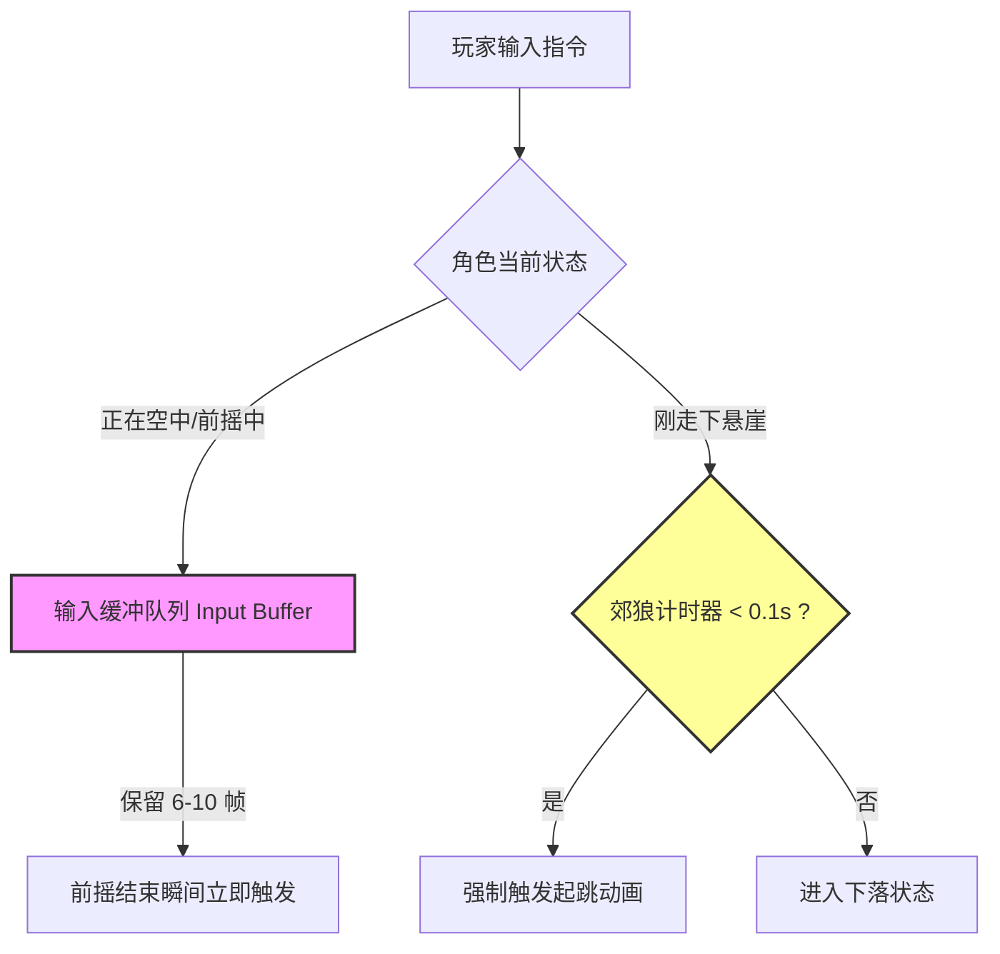
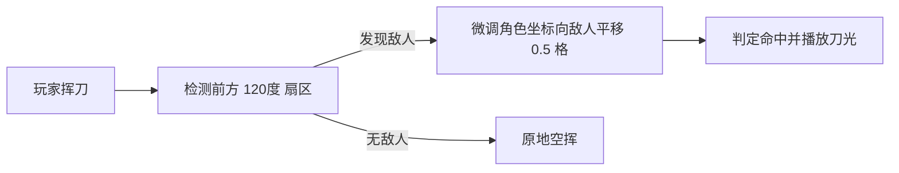

# 《死亡细胞》动作设计哲学：欺骗玩家大脑的“善意谎言”
> 🎙️ **演讲者**: Sébastien Benard (Motion Twin 核心开发者) | **年份**: GDC 2019
> 💡 *本文章由 AI 深度提炼生成。还原了动作游戏开发中最著名的“宽容机制与视觉欺骗法则”。*

<iframe width="100%" height="450" src="https://www.youtube.com/embed/2rn9q1c26bU" frameborder="0" allowfullscreen></iframe>

---

## 🎯 核心 Takeaways (省流总结)

玩家玩《死亡细胞》时总觉得自己像个反应神速的格斗大师，但主创 Sébastien 在 GDC 2019 上坦白：**“其实这都是我们用代码编造的善意谎言。”**

如果一个动作游戏完全遵循严格的真实物理和像素级判定，玩家会觉得游戏极其笨重、僵硬且“吃按键”。《死亡细胞》的丝滑打击感建立在 5 大核心宽容算法之上：
1. **郊狼时间 (Coyote Time)**：走空悬崖后的 6 帧内，跳跃仍然生效。
2. **输入缓冲队列 (Input Buffering)**：在前一个动作未结束前按下的攻击指令会被暂存并在第一帧执行。
3. **近身吸附与动态位移 (Sticky Movement & Snapping)**：普通攻击会自动微调角色位置，帮玩家“贴”向敌人。
4. **攻击窗口保护 (Attack Interruption Protection)**：受到轻微攻击时不会立即打断玩家的重攻击前摇。
5. **动态帧冻结 (Hitstop Scaling)**：根据暴击倍率动态拉长顿帧时间，强化打击感。

---

## 🏗️ 完整还原：5 大“手感欺骗”工程设计

### 1. 郊狼时间 (Coyote Time) 与 边缘保护
取名自经典动画《兔八哥》里的郊狼——跑出悬崖后在空中停滞一秒才掉下去。
*   **痛点**：人类大脑的视觉反应延迟约为 150-200ms。当玩家“以为”自己在悬崖最边缘起跳时，实际上模型已经在空中了。如果不加处理，玩家会直接跌落并痛骂“游戏吞我按键”。
*   **实现**：当玩家脱离地面的前 `6 帧 (约 100ms)` 内，角色虽然处于下落状态，但系统依然标记 `IsGrounded = true`，只要按下跳跃键立即重置垂直速度并施加向上冲量。

### 2. 智能朝向修正与近身吸附 (Attack Tracking)

*   **解决空刀挫败感**：在快节奏横版战斗中，玩家经常因为微小的距离差“差一个像素没打中”。
*   **隐形磁铁**：系统会在玩家按下攻击时，自动向有效目标方向施加一个微小的瞬时牵引力（Snap-to-target），让刀刃刚好够到敌人，产生“招招到肉”的流畅连击体验。

### 3. 打击感的物理与视听拆解

| 机制名称 | 运作逻辑 | 对玩家心理的影响 |
| :--- | :--- | :--- |
| **顿帧 (Hitstop)** | 击中敌人瞬间，双方动画冻结 1-3 帧（暴击时 5 帧） | 模拟利刃切入骨肉的阻力感 |
| **受击缩放 (Squash & Stretch)** | 敌人被击中第一帧在受力方向压扁 10%，下一帧弹回 | 视觉上赋予敌人肌肉与质量感 |
| **摄像机微震 (Impulse Shake)** | 依据武器重量施加方向性的微小晃动 | 强化破坏力与压迫感 |
| **击退衰减 (Knockback Damping)** | 强力的瞬间初始速度 + 极高阻尼减速 | 既打出距离，又不会把怪打飞太远导致连招中断 |

---

## 💡 独立动作游戏避坑指南

1. **绝对不要追求“物理真实”**：真实的人体动作惯性极大、转身迟缓。动作游戏的本质是**“动作电影的交互化”**，手感必须优先于物理规律。
2. **所有攻击都必须允许被翻滚打断 (Cancel Window)**：给玩家最高的生存自主权。如果在按下攻击后进入 1 秒完全无法操作的硬直，玩家会产生强烈的失控感。
3. **优先做视觉减法**：特效不是越多越好。当屏幕上有 10 只怪同时攻击时，必须动态压低杂兵特效透明度，突出危险警示红光。

---

## 🔍 寻找遗失的细节？查阅原稿

??? abstract "点击展开：查看 Sébastien 关于手感打磨的核心原话"

    **关于游戏设计的“不公平偏袒”**
    > **Sébastien Benard**: "If a player thinks they pressed jump in time, they did. Your job as a programmer is not to enforce cold, hard frame counters. Your job is to make the player feel like a ninja, even if their fingers are slightly late."
    > 
    > **中译**: “如果玩家觉得自己按跳跃按得及时，那他就是按及时了。你作为一个程序员的职责，不是去冷酷地执行逐帧计数器，而是让玩家觉得自己像个身手敏捷的忍者，哪怕他的手指其实慢了那么几个毫秒。”

---
*本文由 AI 全栈智能代理 Antigravity 整理归档。*
