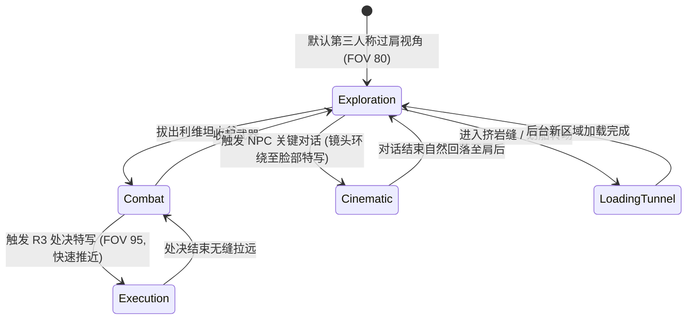
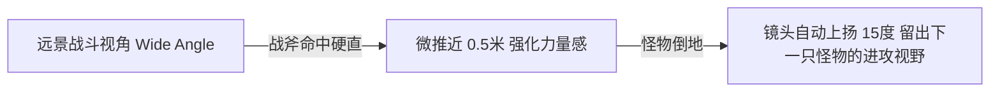

# 《战神4》“一镜到底”技术全揭秘：如何在无剪辑镜头下无缝融合叙事与战斗
> 🎙️ **演讲者**: Dori Arazi (索尼圣莫尼卡工作室摄影指导) | **年份**: GDC 2019
> 💡 *本文章由 AI 深度提炼生成。深度解析 3A 历史上最疯狂的技术实验——从头到尾没有一次镜头剪辑的艺术与工程实现。*

<iframe width="100%" height="450" src="https://www.youtube.com/embed/jZ1W0HjK0vQ" frameborder="0" allowfullscreen></iframe>

---

## 🎯 核心 Takeaways (省流总结)

当制作人 Cory Barlog 宣布《战神4》(God of War 2018) 将采用**全程一镜到底 (No-Cut Camera)** 时，几乎整个工程团队都认为他疯了。

这意味着：从奎托斯砍树开场，到穿过九界、大战巴德尔、击杀巨龙，再到最终通关字幕升起，**整个游戏没有任何一次黑屏切镜、没有传统的过场动画剪辑**。

支撑这个奇迹的四大技术柱石：
1. **动态镜头装配线 (The Master Camera Rig)**：同一个摄像机在过场、探索、战斗、攀爬之间无缝平滑插值。
2. **环境掩护式加载 (Environmental Seams)**：利用挤门缝、爬山洞、世界之树迷宫隐藏场景流式加载 (Streaming)。
3. **自适应 FOV 扭曲与智能避障**：战斗时扩大视场角，特写对话时拉近并压窄，镜头永远不被墙体切碎。
4. **演员与骨骼空间强制对齐 (Root Motion Hand-off)**：在过场动画结束交回玩家控制的第 0 帧，角色姿势与镜头位置必须 100% 吻合。

---

## 🏗️ 完整还原：一镜到底的摄像机状态机

### 1. 如何在不切镜头的情况下加载 50GB 的世界？

在传统游戏中，换地图只需要黑屏 3 秒放个 Loading 条。但在《战神》中：

| 场景需求 | 传统 3A 做法 | 《战神4》一镜到底做法 |
| :--- | :--- | :--- |
| **大型 Boss 战转场** | 播放预渲染 CG 动画，后台重置 Boss 战场景 | 奎托斯骑在巨龙头上俯冲砸入地面，镜头全程跟随震动，地表下层场景在下落的 4 秒内瞬时流式加载完毕 |
| **九界传送** | 弹出加载界面并显示攻略提示 | 走进“世界之树空间 (Yggdrasil Realm)”，奎托斯在纯白迷宫里绕圈跑，直到新地图加载完毕才允许打开门 |
| **空间狭窄过道** | 简单的门切换 | 奎托斯侧身挤过狭窄岩缝，摄像机紧贴后背，物理遮挡住前方视野，遮蔽新房间的渲染流水线 |

### 2. 战斗与叙事的情绪焦距传递

镜头不仅是一个观察器，它是**阿特柔斯（儿子）在旁观父亲的隐形视角**。当奎托斯情绪愤怒时，镜头会产生手持抖动；当父子温情交流时，镜头会极其平缓地滑行。

---

## 💡 开发者启示：一镜到底的巨大代价

1. **不可撤回的叙事成本**：在传统电影剪辑中，一句台词没录好，切个特写就能补拍。在一镜到底里，任何一个角色的动作穿模，整个 5 分钟的长镜头动画必须全部重做。
2. **关卡设计的严格拓扑**：所有关卡的入口、出口、走廊宽度，都必须精确匹配摄像机碰撞球 (Camera Collision Sphere) 的半径，不能有任何死角把镜头卡进墙体里。

---

## 🔍 寻找遗失的细节？查阅原稿

??? abstract "点击展开：查看 Dori Arazi 关于一镜到底的核心原话"

    **关于为什么必须坚持一镜到底**
    > **Dori Arazi**: "Every time you cut the camera, you remind the audience that they are watching a movie. By removing cuts completely, we remove the barrier between Kratos, Atreus, and the player. You are trapped in that emotional journey with them from second one to the very end."
    > 
    > **中译**: “每一次你剪切镜头，你都是在提醒观众他们正在看一部电影。通过彻底消除切镜，我们消除了奎托斯、阿特柔斯与玩家之间的隔阂。从第一秒到最后一刻，你被牢牢‘困’在了他们两人的情感旅途之中。”

---
*本文由 AI 全栈智能代理 Antigravity 整理归档。*
