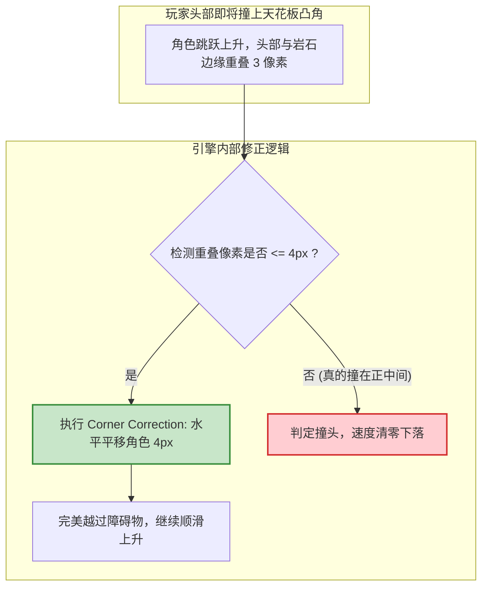

# 《蔚蓝》(Celeste) 平台跳跃手感黑魔法：30+个隐藏在代码里的隐形宽容机制
> 🎙️ **演讲者**: Maddy Thorson (《蔚蓝》独立制作人) | **年份**: GDC 2019
> 💡 *本文章由 AI 深度提炼生成。全面拆解高难度平台跳跃神作如何通过几十个隐形算法让玩家产生“自己操作完美”的幻觉。*

<iframe width="100%" height="450" src="https://www.youtube.com/embed/wa4eBq_9Nzg" frameborder="0" allowfullscreen></iframe>

---

## 🎯 核心 Takeaways (省流总结)

《蔚蓝》是一款以“高难度硬核受苦”著称的像素跳跃游戏，玩家平均要死几千次。然而奇妙的是，**几乎没有玩家会抱怨游戏手感不好或判定不公**。

Maddy Thorson 在 GDC 2019 上公开了游戏底层超过 **30 个“暗中作弊帮助玩家”的微小宽容机制**。其核心理念是：**“当玩家的操作和物理碰撞发生 1-4 个像素的冲突时，物理法则必须给玩家让步。”**

最经典的四大黑魔法：
1. **转角角落校正 (Corner Correction / Nudging)**：头顶撞到天花板边缘时，代码自动把角色向侧面推 4 个像素滑过去，而不是垂直弹回去。
2. **跳跃缓冲 (Jump Buffering)**：落地前 4 帧按下跳跃键，落地瞬间自动弹跳。
3. **半重力顶点悬停 (Half-Gravity Apex)**：在跳跃最高点的几帧内重力减半，让玩家有充裕时间调整冲刺方向。
4. **穿墙冲刺宽容 (Dash Lenience)**：斜向冲刺如果差几个像素卡进墙角，系统自动修正坐标使其顺畅滑入缝隙。

---

## 🏗️ 完整还原：隐形宽容算法示意图

### 1. 四大核心辅助参数量化表

| 机制名称 | 宽容阈值 | 传统游戏的表现 | 《蔚蓝》的隐形修正 |
| :--- | :--- | :--- | :--- |
| **顶部角落修正** | `4 像素 (Pixels)` | 头部擦到天花板，跳跃被打断下坠 | 自动横移角色，顺滑擦过天花板边缘 |
| **底部边缘攀爬** | `3 像素 (Pixels)` | 差一点没够到平台边缘，摔落死亡 | 自动提升角色高度，吸附上平台 |
| **跳跃输入缓冲** | `4 帧 (约 66ms)` | 落地前按跳跃无效，玩家痛骂吃键 | 暂存指令，触地帧以全额力量跳起 |
| **滞空重力衰减** | 垂直速度接近0时 | 抛物线极其短暂，难以及时调整 | 降低重力 50%，提供 0.15 秒的“悬停瞄准”窗口 |

### 2. 冲刺判定：八方向死区与吸附

---

## 💡 精确跳跃游戏开发避坑指南

1. **碰撞盒必须比视觉图像小 (Small Hitboxes)**：主角玛德琳的身体判定盒只有 `8x11` 像素，而危险尖刺的伤害判定甚至比尖刺图像小了整整 2 个像素！**宁可让玩家看着像擦边活下来，也绝不要让玩家看着没碰到却暴毙。**
2. **手感好不等于简单**：宽容机制没有降低关卡的解谜难度，它消除的是“由于输入微小抖动带来的无效挫败感”，让玩家把 100% 的精力花在策略思考上。

---

## 🔍 寻找遗失的细节？查阅原稿

??? abstract "点击展开：查看 Maddy Thorson 关于隐藏机制的原话"

    **关于为什么要在代码里偷偷给玩家“作弊”**
    > **Maddy Thorson**: "Players don't want real physics; they want the feeling of having executed what was in their imagination. If their intent was to jump across the gap, but they were off by 2 pixels, punishing them breaks the magic. Forgiving those 2 pixels makes them feel like a god."
    > 
    > **中译**: “玩家并不想要真正的真实物理，他们想要的是‘完美执行了脑海中所想象的操作’那种成就感。如果他们的本意是跳过这个深渊，但手指偏了区区 2 个像素，惩罚他们会彻底打破这种沉浸魔力。而暗中包容这 2 个像素，会让他们觉得自己宛如微操之神。”

---
*本文由 AI 全栈智能代理 Antigravity 整理归档。*
