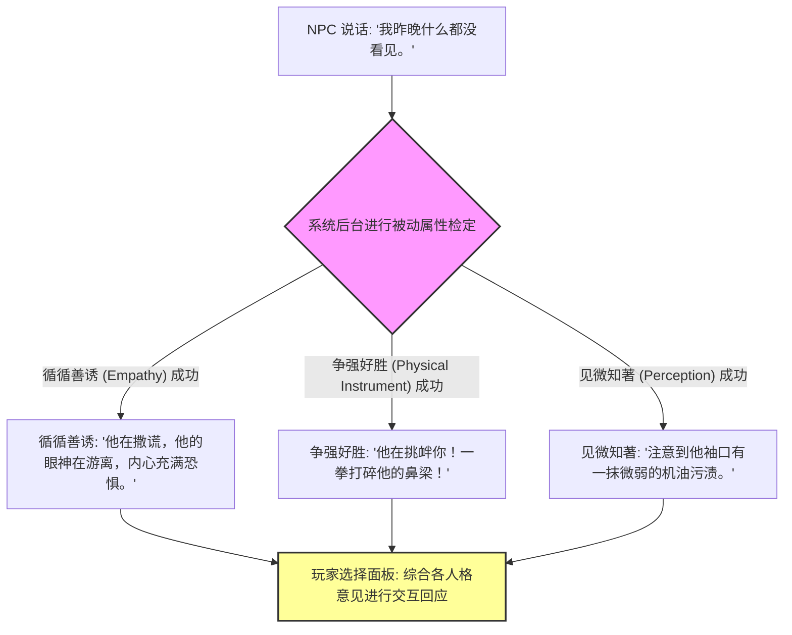

# 《极乐迪斯科》叙事工程学：如何驾驭百万字网状文本与“思维阁”系统
> 🎙️ **演讲团队**: ZA/UM (核心叙事与技术团队) | **年份**: GDC 2020
> 💡 *本文章由 AI 深度提炼生成。深入剖析了 RPG 历史上最复杂的文本网络与技能人格化系统架构。*

<iframe width="100%" height="450" src="https://www.youtube.com/embed/Pj13iF-W74k" frameborder="0" allowfullscreen></iframe>

---

## 🎯 核心 Takeaways (省流总结)

《极乐迪斯科》拥有超过 **100 万字**的庞大文本量，但它没有让玩家感到枯燥，反而创造了叙事 RPG 的新巅峰。

其叙事架构的核心革命：
1. **技能的人格化内斗 (Skills as Characters)**：24 种属性技能不再是冰冷的被动数值，而是 24 个寄生在主角大脑中的“不同人格”，随时插嘴争吵。
2. **思维阁系统 (The Thought Cabinet)**：将“思考过程”游戏化——接受观念、消化内省、最终固化为永久特质与世界观修正。
3. **网状对话图谱 (Non-linear Web Nodes)**：利用高度模块化的对话引擎，避免分支爆炸，保证无论玩家走向何种极端人格，故事都能收束推进。

---

## 🏗️ 完整还原：24 种技能人格的对话插话机制

在原演讲中，团队展示了《极乐迪斯科》如何将传统的“检定掷骰”转变为大脑内部的交响乐：



### 1. 24 个“内在声音”的分类矩阵

ZA/UM 将人类心智划分为四大维度，每个维度衍生出 6 个相互制衡的子技能：

| 心智维度 | 代表技能 | 在对话中的典型行为 |
| :--- | :--- | :--- |
| **智力 (Intellect)** | 逻辑思维、百科全书、修辞学 | 絮絮叨叨讲历史背景、挑逻辑漏洞、卖弄学识 |
| **心理 (Psyche)** | 循循善诱、权威、内陆帝国 | 洞察他人情绪、追求权力压制、与无生命物体通灵对话 |
| **体魄 (Physique)** | 争强好胜、坚韧不拔、电化学 | 崇尚暴力解决、提供耐痛能力、诱惑主角去嗑药狂欢 |
| **身手 (Motorics)** | 见微知著、反应速度、同舟共济 | 发现微小线索、抢先拔枪、感受整座城市的脉搏与呼吸 |

### 2. 思维阁系统 (Thought Cabinet)：观念的消化机制

思维阁将抽象的哲学、政治思潮变成了可装备的“思维道具”：

```mermaid
flowchart LR
    Acquire[在对话中触发特殊事件获得 '思维种子'] --> Incubate[放入思维阁插槽开始 '内省倒计时 (如需游戏内 6 小时)']
    Incubate -->|内省期间产生临时负面属性惩罚| Evolve[完成固化: 获得永久特质 & 解锁全新独家对话选项]
```

---

## 💡 叙事设计师避坑指南

1. **避免分支爆炸 (Branching Explosion)**：不要每个选择都分裂出一个全新结局。采用**“宽泛输入、局部收束 (Wide-Input, Local-Convergence)”**模式——过程可以千差万别，但事件的核心里程碑保持锚定。
2. **失败必须是有趣的 (Fail Forward)**：检定失败不应该直接 Game Over，而应该带来荒诞、出人意料且同样推进剧情的滑稽后果（例如：试图飞踢NPC却把自己的老腰闪了）。
3. **赋予文字视听节奏**：短句交错、关键字加粗染色、在关键顿悟时刻配合专门定制的环境音效（Ding!）。

---

## 🔍 寻找遗失的细节？查阅原稿

??? abstract "点击展开：查看 ZA/UM 团队关于网状文本管理的原话"

    **关于技能人格化设计的初衷**
    > **Justin Keenan**: "Traditional RPGs treat skills like invisible lockpicks: either you have 50 lockpicking to open the door, or you don't. We wanted skills to feel like annoying roommates living inside your skull who won't shut up and constantly give you terrible advice."
    > 
    > **中译**: “传统 RPG 把技能当作隐形开锁器：你要么有 50 点开锁技能打开门，要么打不开。而我们希望技能像住在大脑里的烦人室友——他们永远闭不上嘴，而且不断给你出馊主意。”

---
*本文由 AI 全栈智能代理 Antigravity 整理归档。*
