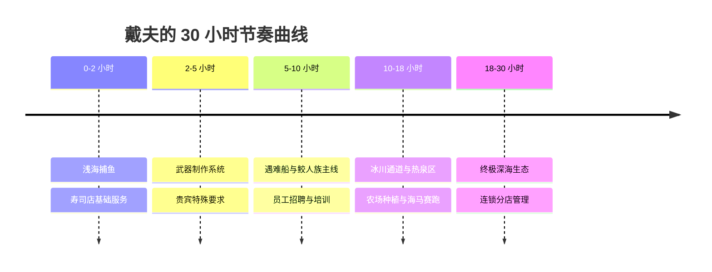

# 《潜水员戴夫》混合玩法循环设计：双核心驱动与心流节奏控制
> 🎙️ **演讲团队**: MINTROCKET (NEXON 子团队) | **年份**: GDC 2024
> 💡 *本文章由 AI 深度提炼生成。全面拆解了现象级爆款背后的“双循环互哺架构”与“小游戏防疲劳系统”。*

<iframe width="100%" height="450" src="https://www.youtube.com/embed/Pj13iF-W74k" frameborder="0" allowfullscreen></iframe>

---

## 🎯 核心 Takeaways (省流总结)

《潜水员戴夫》成功将两种完全不同的游戏类型（白天水下探索 Roguelite + 夜晚寿司店模拟经营 Tycoon）缝合在一起，并售出了数百万份。

MINTROCKET 在 GDC 2024 上分享的核心经验：
1. **资源的完美互哺 (Dual-Loop Synergy)**：白天的产出是夜晚的原料，夜晚的利润是白天装备升级的资本，形成永动机式的正向循环。
2. **张弛有度的多巴胺节拍 (Tension & Release Pacing)**：高强度的深海生存 vs 轻松愉悦且确定性强的经营收菜。
3. **“俄罗斯套娃”式的内容解锁**：绝不一次性塞满系统，每隔 2-3 个小时解锁一个全新的小游戏（农场、养鱼场、海马赛跑），彻底消除中后期疲劳。

---

## 🏗️ 完整还原：双循环生态系统图谱

```mermaid
flowchart TD
    subgraph DayLoop[白天：蓝洞探险 (紧张与探索)]
        D1[潜水捕鱼 / 收集食材] --> D2[遭遇深海巨兽 / 氧气资源危机]
        D2 --> D3[带着优质渔获与图纸安全升水]
    end
    
    subgraph NightLoop[夜晚：班乔寿司店 (轻松与收成)]
        N1[根据渔获定制菜单] --> N2[极速配餐与倒茶服务]
        N2 --> N3[结算海量金币与口碑]
    end
    
    D3 -->|提供食材与稀有调料| N1
    N3 -->|金币投资武器升级/氧气瓶升级| D1
    
    style DayLoop fill:#e1f5fe,stroke:#0288d1,stroke-width:2px
    style NightLoop fill:#fff3e0,stroke:#f57c00,stroke-width:2px
```

### 1. 探索与经营的数值咬合

| 环节 | 玩家体验状态 | 核心动力与消耗 |
| :--- | :--- | :--- |
| **上午潜水** | 探索未知、轻度压力、背包空间权衡 | 消耗氧气与弹药，获取基础鱼肉 |
| **下午潜水** | 针对特定食谱进行精准深潜狩猎 | 挑战精英Boss，获取高级食材 |
| **夜晚开店** | 快节奏手速反应、数字飞涨的爽感 | 消耗白天食材，收获核心货币（金币） |
| **睡前升级** | 享受成长带来的长线收益 | 消耗金币强化潜水服深度与负重上限 |

### 2. 内容节奏的“延时满足”设计



---

## 💡 混合玩法游戏避坑指南

1. **避免双重惩罚**：如果白天潜水死掉了，如果扣光所有东西，玩家晚上开店就会“无米下锅”，直接导致经营停滞退游。戴夫的设计是：死亡时**允许保留一件最心仪的战利品**，确保夜晚依然有基本收入。
2. **两套玩法必须权重相当**：如果玩家只喜欢捕鱼而极度讨厌开店，游戏就崩了。因此寿司店玩法被极度简化（去掉了复杂的烹饪模拟，聚焦于倒茶、跑堂、雇员自动化）。
3. **动画表演是第一生产力**：厨师班乔切三文鱼的 2 秒专属像素过场动画，极大地强化了升级菜谱的成就感。

---

## 🔍 寻找遗失的细节？查阅原稿

??? abstract "点击展开：查看 MINTROCKET 团队关于玩法节奏的原话"

    **关于如何避免多品类缝合时的违和感**
    > **Jaeho Hwang**: "The secret is that the two genres serve each other's emotional downtime. After 30 minutes of tense oxygen management under deep water, your brain craves a cozy, predictable loop where you just serve delicious food to happy customers."
    > 
    > **中译**: “秘诀在于两个品类正好互补了彼此的情绪低谷期。在深海经历 30 分钟紧张的氧气管理后，你的大脑极度渴望一个温馨、可预测的循环——在那里你只需要给开心的顾客端上美味的寿司。”

---
*本文由 AI 全栈智能代理 Antigravity 整理归档。*
